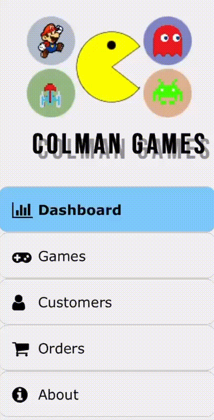

# Online-Video-Game-Store
Final project in Web Application Development course at Colman, conducted by Dr. Igor Rochlin.

## Description
"Colman Games" is games shop management tool used by the company to keep track of games, customers and orders - all in just one page.


The website devided to diffrent sections which we can reach through the sidebar.


## Dashboard
In the dashboard section you can monitor information about the server like, OS, CPU, Uptime and number of clients connected - all of those are possible using Socket.io package used [here](public/js//websockets.js).

Moreover, we used D3.js package in order to show diffrent analytics of the store in a nicer way, just like Games-Categories piechart and linechart showing the growth of customers overtime. the code for the followings shown [here](public/js/dashboardCharts.js).

Additionally, you can see in the Dashboard section some new "Gaming" related articles from the past month, bringed by News API, and coded [here](public/js/newsApi.js).

## Games
In the games section you can browse between varity of games avilable in the shop, search using searching tool or choose between adding a new game, editing one or deleting an old one.

Each row of data provide you the name of the game as well as the image of it, a trailer that will pop up when you click the image and some more inforamtion.

Twiter API - Whenever you'll try to add a new game, an option to post a tweet in [our account](https://twitter.com/AlatzGames) will pop up, thanks to the API we used.
``` js
if (publishOnTwitter) {
            // consturcting the tweet text
            var msg = "New game released!\n" + req.body.gameName + " is now available on " + req.body.platform + " for $" + req.body.unitPrice + ".\nCheck it out!";
            if (req.body.image) {
                // tweeting along with the image of the created game, if it exists
                twitterClient.tweetWithImage(msg, req.body.image);
            } else {
                // otherwise, tweeting just the message
                twitterClient.tweet(msg);
            }
        }
```

## Collaborators
- [Ron Greenberg](https://github.com/RonGreenberg)
- [Aviv Keinan](https://github.com/avivk9)
- [Yonatan Birman](https://github.com/yonatan1710)
- [Itamar Azmoni](https://github.com/Itamar-Azmoni)

### Link To The [Website](http://45.32.236.220:8080)